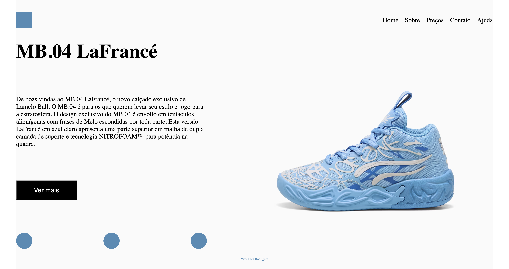

## Galeria de Imagens

## Sobre
Site de um layout de produto para divulgar e colocar em prática os conhecimentos adquiridos sobre linguagem de marcação, HTML e CSS durante o curso de desenvolvimento de sistemas do [SENAI Jandira](https://sp.senai.br/unidade/jandira/)

---

## Tecnologias utilizadas
- HTML
- CSS
- Markdown
- Git

---

## Autor
- [Vitor Paes Rodrigues](https://www.linkedin.com/in/vitor-paes-166b95295/)